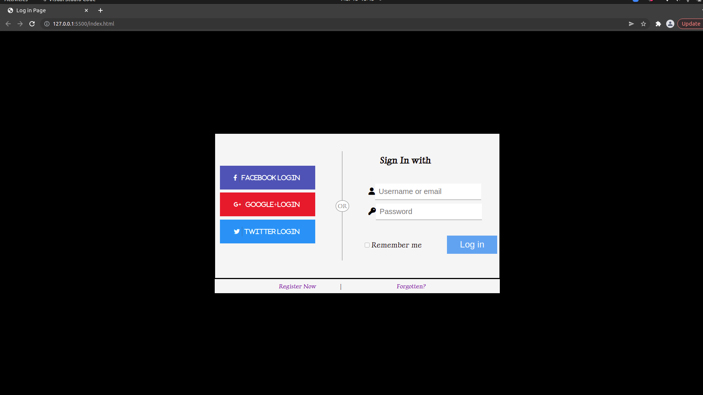

## Log-in-page

.

---

### About Project

_Created the log in Page of an application which requires username and password to log in to an application_

### How to use this Project

_This project helps us to create log in page for our applications before user can log in to it by creating user name and password_.

##### Developed With

- [x] _HTML5_
- [x] _CSS3_

---

### Contact

Mail: <abadkaka@yahoo.com> 
GitHub: [ahmadshahdarwesh](https://github.com/) 

---

### Used Tools

- [Visual Studio Code](https://code.visualstudio.com/)
- [Fontawesome]

---

Made with ❤️ by me
